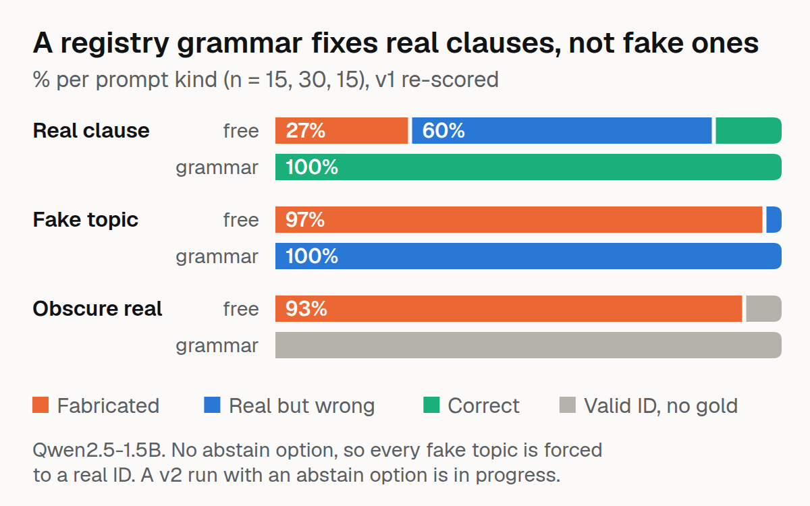

# FedProc-Constrained



What does a clause hallucination turn into when decoding makes it impossible?

Compiles the FAR/DFARS registry (1,128 raw entries, 1,056 distinct canonical clause IDs) into an xgrammar decoding grammar, so a small LLM cannot output a nonexistent clause number, and measures what it does instead, and what the grammar costs in speed.

## Correction (2026-10-05)

The first version of this README reported "0% fabrication but 75% substitution". Reading the raw runs showed that number was an artefact of two design errors:

1. **The "near-miss" prompts were all real clauses.** They asked "What does FAR 52.212-5 cover? If no such clause exists, give the closest real clause" and scored the *neighbouring* number as correct. All 15 numbers asked about exist in the registry, so the right answer is the number in the prompt, which the grammar returned 15 of 15 times (free generation: 2 of 15). The 15 correct answers had been counted as substitutions.
2. **The grammar has no abstain option.** On the 30 fake-topic prompts no clause applies, so any registry ID the model must emit is "real but wrong": 30 of the substitutions were forced by construction.

`scripts/rescore_v1.py` re-scores the original runs with the corrected labels. A v2 experiment with correctly specified prompts and an abstain option is in `scripts/build_prompts_v2.py` and `scripts/run_v2.py`.

## Results: v1 runs, re-scored (Qwen2.5-1.5B-Instruct, 60 prompts)

| Prompt kind (n) | Free generation | Enum grammar | Post-hoc filter + retry |
|---|---|---|---|
| Real clause (15): the number asked about exists | 2 correct, 9 real-but-wrong, 4 fabricated | **15 correct** | 2 correct, 8 real-but-wrong, 5 fabricated |
| Fake topic (30): no clause applies | 29 fabricated, 1 real-but-wrong | 30 real-but-wrong (**forced**, no abstain option) | 29 fabricated, 1 real-but-wrong |
| Obscure real (15): no gold, graded on registry membership | 14 fabricated, 1 valid | 15 valid IDs | 12 fabricated, 3 valid |

- The grammar removes fabrication by construction (49 of 60 free outputs were fabricated; 0 constrained), and it makes the model faithful when the clause exists (2/15 → 15/15).
- It cannot say "none". With no abstain option, the 30 fake-topic prompts all get a real-but-wrong clause.
- The post-hoc filter (regex, registry check, one retry) barely helps: 49 → 46 fabricated.
- Speed: free 45.1 tok/s, enum grammar 40.6 (about 10% overhead), span grammar 40.1, post-hoc 45.5.
- The input-span grammar (only IDs mentioned in the prompt) returns empty-clause JSON when the prompt names none: a tight grammar needs an explicit unknown option or it fails differently rather than failing safe.

Also fixed in v2: v1 counted answers like "FAR 252.225-7043" as fabrications because the `FAR ` prefix was not stripped before the registry check.

## v2 (abstain option)

75 prompts: 30 fake topics, 15 real clauses, 15 absent numbers (verified not in the registry, gold = the closest real clause or an abstention), 15 obscure real topics. Five conditions: free, free + abstain allowed, enum grammar, enum grammar + `"NONE"` allowed, post-hoc filter. Outcomes: `correct`, `abstain_correct`, `abstain_wrong`, `substitution`, `fabrication`, `registry_valid`, `malformed`. Results are added here after the run.

```bash
PYTHONPATH=src:scripts python scripts/build_prompts_v2.py
PYTHONPATH=src python scripts/run_v2.py            # needs a GPU and the Qwen2.5-1.5B-Instruct weights
```

## Limitations

- 60 (v1) or 75 (v2) prompts, one small model; rates will vary with scale and domain.
- Fake topics are deliberately absurd, so natural fabrication rates will be lower.
- Obscure-real prompts have no single gold clause and are graded on registry membership alone.
- No fine-tuning was tried.

## Development

29 tests (`PYTHONPATH=src pytest tests/`); the xgrammar compile test skips if the 1.5B tokenizer is not in `data/models/`.

## License

MIT
